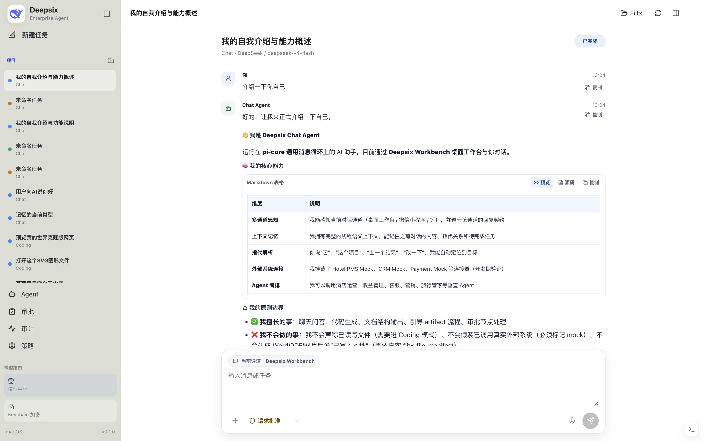

# Deepsix — 自迭代 AI Agent Workbench

> **原名 Fiitx** · 基于 Electron + React + BYOM（Bring Your Own Model）的桌面端企业级 Agent 工作台。  
> 核心理念：**让 AI Agent 在 Deepsix 内升级迭代 Deepsix 自己。**

---

## 项目定位

<p align="center">
  
</p>

Deepsix 不是又一个 AI Chat 客户端。它是一个**自托管的 Agent 操作系统雏形**，参考了 Pi (@earendil-works)、OpenClaw、Codex 等架构思路，实现了：

- LLM 原生的 Agent 循环（不是 Chat 壳）
- 结构化记忆与上下文压缩（替代无脑填满 Context Window）
- 多 Agent 编排（类最近微信 AI 小程序 Skill 化的思路）
- 文件系统级别的 Diff 引擎与跨文件感知
- 权限审批（企业级安全策略门控）

## 界面多语言

Fiitx 界面默认跟随系统语言，也可以在 `Settings > General > Language` 手动切换。当前支持 English、全球主要使用人群语种，以及繁体中文：

| Locale | 语言 |
|--------|------|
| `en` | English |
| `zh` | 简体中文 |
| `zh-TW` | 繁體中文 |
| `hi` | हिन्दी / Hindi |
| `es` | Español / Spanish |
| `fr` | Français / French |
| `ar` | العربية / Arabic |
| `bn` | বাংলা / Bengali |
| `pt` | Português / Portuguese |
| `id` | Bahasa Indonesia / Indonesian |
| `ur` | اردو / Urdu |
| `ru` | Русский / Russian |

#### 点击观看演示视频
<a href="https://www.youtube.com/watch?v=UMXBwSsjEgA" target="_blank">
  
</a>

---

## 架构路线图

### ✅ 1. Agent Loop — LLM 原生驱动循环

| 组件 | 路径 | 状态 |
|------|------|------|
| Agent Runtime (Pi Kernel 集成) | `electron/services/agent-runtime.cjs` | ✅ 完成 |
| Pi Agent Kernel | `electron/services/pi-agent-kernel.cjs` | ✅ 完成 |
| Tool Agent Loop | `electron/services/tool-agent-loop.cjs` | ✅ 完成 |
| Agent Executor | `electron/services/agent-executor.cjs` | ✅ 完成 |

**实现要点：**
- 集成 `@earendil-works/pi-agent-core` / `pi-ai` 作为底层 Agent 内核
- 支持 tool-calling、streaming、thinking block 等原生 LLM Agent 协议
- 消息格式兼容 OpenAI API (Pi 语义)，支持工具调用结果回合
- 完整的会话上下文注入（transformContext / 结构记忆）

---

### ✅ 2. 上下文与记忆架构 — 结构化记忆及压缩

| 组件 | 路径 | 状态 |
|------|------|------|
| 结构化记忆引擎 | `electron/services/structured-memory.cjs` (19KB) | ✅ 完成 |
| 记忆类型系统 | 7 种类型: summary / fact / artifact / decision / constraint / pending / tool_result | ✅ 完成 |
| 增量提取 + 自动压缩 | 超过阈值自动归档为摘要 | ✅ 完成 |
| 重要性权重衰减 | HIGH(9) / MEDIUM(6) / LOW(3) / TRIVIAL(1) | ✅ 完成 |
| 线程级上下文管理 | `electron/services/thread-store.cjs` | ✅ 完成 |

**设计原则：** 保留最近 N 轮原始消息，更早的消息提炼为结构化记忆条目，在 LLM 调用前注入记忆上下文提示词，替代完整的旧消息回放。

---

### ✅ 3. 多 Agent 编排 — 类微信 AI Skill 化思路

| 组件 | 路径 | 状态 |
|------|------|------|
| Agent Orchestrator | `electron/services/agent-orchestrator.cjs` (18KB) | ✅ 完成 |
| Intent Router | `electron/services/intent-router.cjs` | ✅ 完成 |
| 微信 AI Skill Gateway | `electron/services/wechat-ai-skill-gateway.cjs` (17KB) | ✅ 完成 |
| Specialized Agents 目录 | `electron/services/specialized-agents/` | ✅ 完成 |
| 微信 Channel Server | `electron/services/wechat-channel-server.cjs` | ✅ 完成 |
| 多 Channel Adapter | `electron/services/channel-adapters.cjs` | ✅ 完成 |

**实现要点：**
- 支持根据用户意图（intent）路由到不同的专门 Agent
- 微信 AI Skill Gateway 实现了类似微信小程序 Skill 化注册/发现/选择
- Channel Adapter 模式支持桌面 UI、微信小程序等多入口统一编排

---

### ✅ 4. 文件 Diff 引擎与跨文件感知

| 组件 | 路径 | 状态 |
|------|------|------|
| 结构化 Diff 引擎 | `electron/services/diff-engine.cjs` (23KB) | ✅ 完成 |
| 跨文件依赖分析 | 正则匹配 import/require → 有向依赖图 | ✅ 完成 |
| Snapshot 快照管理 | 环形缓冲区 50 个快照，djb2 哈希去重 | ✅ 完成 |
| 影响推断 (BFS) | 从变更文件出发反向遍历依赖 | ✅ 完成 |
| File Manifest | `electron/services/file-manifest.cjs` | ✅ 完成 |

**自研亮点：** 不依赖外部库（没有 jsdiff / diff-match-patch），基于 LCS / Myers 简化算法纯手工实现。

---

### ✅ 5. 权限审批系统

| 组件 | 路径 | 状态 |
|------|------|------|
| Policy Engine | `electron/services/policy-engine.cjs` | ✅ 完成 |
| 敏感文件检测 | `.env` / `.pem` / `.key` / secret/token 等自动拦截 | ✅ 完成 |
| 忽略目录 | `.git` / `node_modules` / `dist` / `release` 等 | ✅ 完成 |
| 文本文件白名单 | 18 种扩展名校验 | ✅ 完成 |
| 审批交互 | 通过 desktop-ui 实现 approve/reject 弹窗 | ✅ 完成 |

---

### 🟡 6. Tools / Skills — 动态注册与沙箱隔离

| 组件 | 路径 | 状态 |
|------|------|------|
| Tool Registry (动态注册) | `electron/services/tool-registry.cjs` (11KB) | 🟡 部分完成 |
| Tool Sandbox (VM 沙箱) | `electron/services/tool-sandbox.cjs` (20KB) | 🟡 部分完成 |
| Tool Runtime | `electron/services/tool-runtime.cjs` (14KB) | 🟡 部分完成 |
| Skill Registry | `electron/services/skill-registry.cjs` (1.7KB) | 🔴 待完善 |
| 热加载 / 版本管理 | — | 🔴 待实现 |

**已实现：** Tool 注册/注销/执行的完整链路，VM 沙箱隔离（Node.js `vm` 模块），资源限制（内存/超时/文件访问控制），政策绑定。

**待完善（企业级可用方向）：**
- 工具热加载 / 插件化注册（无需重启）
- 多版本共存与回滚
- 跨工具依赖与组合编排 DSL
- 远程技能市场 / MCP 标准协议兼容
- Skill 模板与声明式注册（降低第三方开发门槛）

---

### 🟡 7. 可观测性 — 流式推理展示 + 执行轨迹

| 组件 | 路径 | 状态 |
|------|------|------|
| StreamingBus (后端) | `electron/services/observability.cjs` (20KB) | ✅ 后端完成 |
| TraceStore (轨迹存储) | `electron/services/observability.cjs` | ✅ 完成 |
| StepLog (步骤记录) | `electron/services/observability.cjs` | ✅ 完成 |
| 前端流式推理渲染 | `src/App.tsx` | 🔴 待实现 |
| 前端执行轨迹时间线 | — | 🔴 待实现 |

**已实现（后端）：**
- StreamingBus 实时推送 LLM token、思考过程、工具调用
- TraceStore 记录每个 Agent 回合的完整执行轨迹
- StepLog 记录各步骤耗时、token 用量、工具调用统计
- 通过 `emitProgress` 回调推送到前端

**待实现（前端）：**
- 实时流式文本渲染（打字机效果 + thinking block 折叠/展开）
- 执行轨迹时间线 / 火焰图 / 调用树可视化
- Token 用量与成本实时展示
- 错误与重试链路可视化

---

### 🔴 8. 编辑器 — VS Code 集成与 Inline Diff

| 需求 | 状态 |
|------|------|
| VS Code Extension 集成 | 🔴 待实现 |
| Inline Diff 编辑预览 | 🔴 待实现 |
| 工作区文件版本对比 | 🔴 待实现 |
| 文件树 / 资源管理器 | 🟡 已有简单 `workspace-manager` |
| Git 集成 | 🔴 待实现 |

**设计方向：**
- 通过 VS Code Extension API 或独立 Web Editor 提供类 IDE 编辑体验
- Inline Diff 预览模式（Agent 建议修改 → 用户确认 → 应用）
- 支持文件多级 undo/redo + Agent 操作回滚
- 与 Diff Engine 联动，自动标记受影响的跨文件模块

---

### 🔴 9. 继承 ESLint / Prettier / 测试流水线

| 需求 | 状态 |
|------|------|
| ESLint 配置 | 🔴 未配置 |
| Prettier 配置 | 🔴 未配置 |
| 测试框架 (Jest / Vitest) | 🔴 未配置 |
| CI/CD 流水线 | 🔴 未配置 |
| Husky / Lint-Staged | 🔴 未配置 |
| 代码质量门禁 | 🔴 未实现 |

**设计方向：**
- Agent 生成/修改代码后自动触发 lint + format
- 测试感知：Agent 修改代码时自动运行相关测试
- 质量门禁：lint 错误/测试失败时阻断提交流程
- 与 Tool System 联动，将 ESLint/Prettier/Test 注册为可调用的内部工具

---

### ✅ 10. Model 在多 MaaS 间自动路由 — 实现 Model 对用户透明

| 需求 | 状态 |
|------|------|
| Provider Registry | `electron/services/provider-registry.cjs` | ✅ 完成 |
| Model Router | `electron/services/model-router.cjs` | ✅ 完成 |
| 跨 MaaS 自动路由 | 文本 / tool call 透明候选队列 | ✅ 完成 |
| Fallback / 降级策略 | Provider 失败后自动尝试下一个可用 MaaS | ✅ 完成 |
| 成本 / 延迟感知路由 | 结合静态成本、预期延迟、历史成功率、平均延迟、连续失败、熔断状态排序 | ✅ 完成 |
| Model Profile 加密存储 | Electron safeStorage | ✅ 完成 |

**已实现：**
- Provider Registry 为默认 MaaS profile 写入成本、预期延迟和优先级元数据
- Model Router 为文本和工具调用维护跨 Provider 候选队列
- 每次调用记录成功 / 失败、连续失败、平均延迟、token 与估算成本
- 连续失败触发短时熔断，避免同一故障 Provider 被反复选中
- Settings 的模型页面展示路由健康状态、延迟、成功率和成本信息

---

## 能力总览

| 领域 | 已完成 | 进行中 | 待实现 |
|------|--------|--------|--------|
| Agent 循环 | ✅ Agent Runtime + Pi Kernel + Tool Loop | | |
| 记忆与上下文 | ✅ 结构化记忆 + 压缩 + 线程管理 | | |
| 多 Agent 编排 | ✅ Orchestrator + Intent Router + Skill Gateway | | |
| 文件操作 | ✅ Diff 引擎 + 跨文件感知 | | |
| 安全/审批 | ✅ Policy Engine + 敏感检测 | | |
| 工具/技能 | | 🟡 Registry + Sandbox + Runtime | 🔴 热加载/版本/插件化 |
| 可观测性 | | 🟡 后端 StreamingBus + Trace | 🔴 前端流式渲染/时间线 |
| 编辑器 | | | 🔴 VS Code 集成 + Inline Diff |
| 开发工具链 | | | 🔴 ESLint / Prettier / 测试 / CI |
| Model 路由 | ✅ Provider Registry + 跨 MaaS 自动路由 + fallback + 成本/延迟感知 | | |
| 自迭代闭环 | ✅ "在 Deepsix 内升级 Deepsix" 工作流已打通 | | |

---

## 快速开始

```bash
# 安装依赖
npm install

# 开发模式（Vite HMR + Electron）
npm run dev

# 构建生产版本
npm run build
npm run dist
```

应用使用 `assets/deepsix-logo.png` 作为图标，模型配置/API Key 存储在 Electron userData 目录，API Key 支持 Electron `safeStorage` 加密。

### 安装使用桌面版
<p align="center">
  <a href="https://drive.google.com/drive/folders/1ZUEXKVIIfJ6jwLmb5pOWlyAyPy7LF7Ps" target="_blank" 
     style="font-size: 18px; color: #1a73e8; text-decoration: none; border-bottom: 1px solid #1a73e8;">
    📂 Mac桌面版（Google Drive 文件夹）
  </a>
</p>

---

## 技术栈

| 层 | 技术 |
|----|------|
| 渲染层 | React 18 + TypeScript + Vite |
| 桌面壳 | Electron 33 |
| Agent 内核 | Pi Agent Core (@earendil-works) |
| LLM 接口 | OpenAI-compatible API (BYOM) |
| 构建 | electron-builder 25 → DMG/ZIP |
| 图标 | macOS .icns / 通用 .png |
| 加密 | Electron safeStorage |

---

## 自迭代闭环

```
用户需求
    ↓
Agent Loop (Pi Kernel)
    ├──→ 结构化记忆 (上下文压缩)
    ├──→ Intent Router → 专门 Agent
    ├──→ Tool 注册 → Tool Sandbox (沙箱执行)
    ├──→ Policy Gate (审批)
    ├──→ Diff Engine (文件变更感知)
    └──→ Observability (轨迹追踪)
          ↓
    Workspace Write (修改代码/文档)
          ↓
    Deepsix 自身代码被修改 → 重启后新能力生效
          ↓
    "在 Deepsix 内升级迭代 Deepsix 自己" ✅
```

---

## 参考架构

- **Pi** (@earendil-works/pi-agent-core) — Agent 内核与消息协议
- **OpenClaw** — 结构化记忆与上下文压缩思路
- **Codex** — 多 Agent 编排与 skill 注册发现
- **微信 AI 小程序 Skill 化** — Channel Adapter + Skill Gateway 模式
